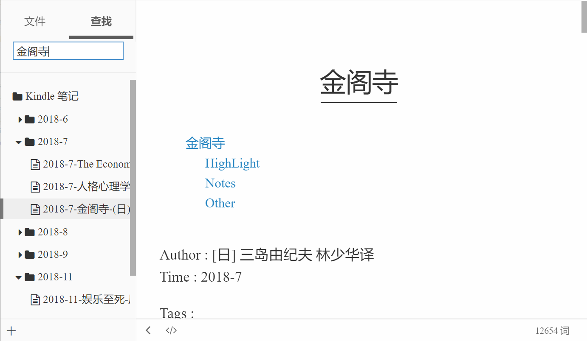
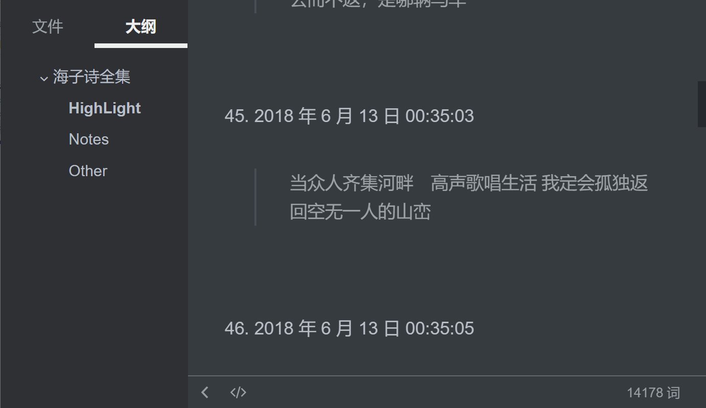
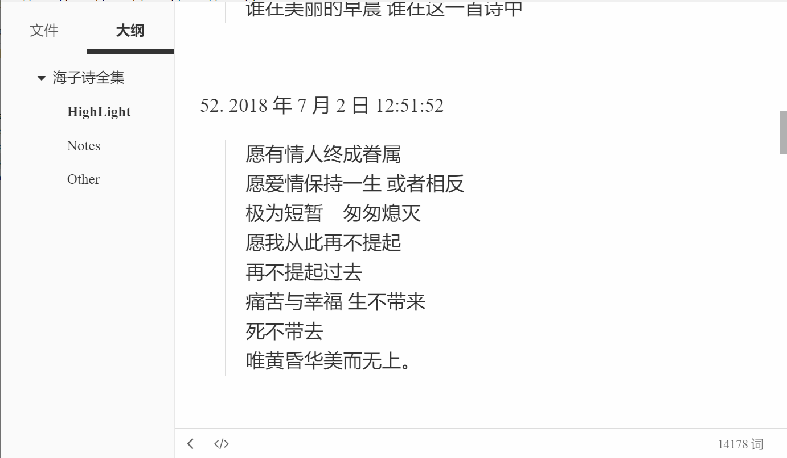

# KindleNotes
Manage and reorganize your Kindle highlight , notes and bookmarks with python. Support building book systems, export structural markdown and category by title, author, tag or nation now.

Executable program `.exe` with PyQt GUI is on the TODO list if necessary. Reading data visualization, get information from Douban database and export to Douban reading notes will be taken into consideration. 

## Usage

1.  Import your clipping.txt from Kindle.
2.  Specify parameters.
    -   Ignored Booklist : [‘知乎’,‘whereismylife’,‘...’]
    -   Ignored Notes Num: Books with less than 20 notes will be ignored in default.
    -   Ignore Author : [‘user@kindle.com’]
    -   Generate mode: 
3.  Run `python kindleimport.py` to build kindle database and output markdown.
4.  Optional: Add or remove , tag or category your books.
5.  Optional: Recommend open kindle notes directory with typora.

## Display

-   Generated by year-month-day (File tree)

-   Different Theme

-   Generate by Author
-   Generate by Nation

## TODO:

- Import data from Kindle clippings.txt  
- Export markdown and reorganize it  
- Read report and statistic  
- Get information of books and author in douban database  
- Manage book and author database 
- Export onenote or evernote
- GUI/Css

## License
Author : @Desein-Yang
